# SAMPLauncherNET

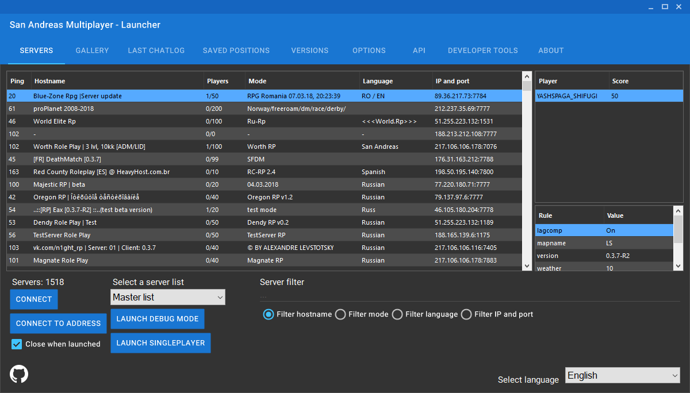

## Features

### Backwards compatibility
Most features that are present in the native SA:MP launcher are present in this application.

### Modernized look
With the use of the Material Design layout the launcher looks modern.

### Multi-language support
If you prefer a different language than the english language, you can easily change the language of the launcher.

### ASI plugin loader and manager
Load or manage any GTA San Andreas compatible ASI plugin within this launcher.
Enable plugins in the plugins manager tab.
Supported and listed ASI plugins by default:
	- [SA:MP Discord Rich Presence plugin](https://github.com/Hual/samp-discord-plugin)

### Multi-threaded query mechanism
Fast server listing, where hundreds of SA:MP servers can be queried at the same time.

### Show extended server information
List any relevant information of a server for example modes or server location with a couple of clicks.

### Improved server filter
Search for your beloved server fast and easily

### Search engines integration
Search anything related to a SA:MP server easily on popular search engines.

### Debug mode and singleplayer
You can launch SA:MP debug mode or Grand Theft Auto San Andreas with a click on a button.

### Media
The media tab allows to manage screenshots, look up the last chatlog and saved positions.

### Sessions data
A very important feature for users who want to record session based data.
This can be enabled at the launcher options.

### Version changer
Change your SA:MP version to your needs by applying a patch or installing manually.

### SA:MP settings
Change your SA:MP settings through an user interface.

### Server list APIs
Manage your server list endpoints, and access lists that were inaccessible through a launcher before.

### Developer tools
Make your server development workflow easier by configuring, starting and joining your test server using the [sampctl](https://sampctl.com/) integration. 

## Screenshots

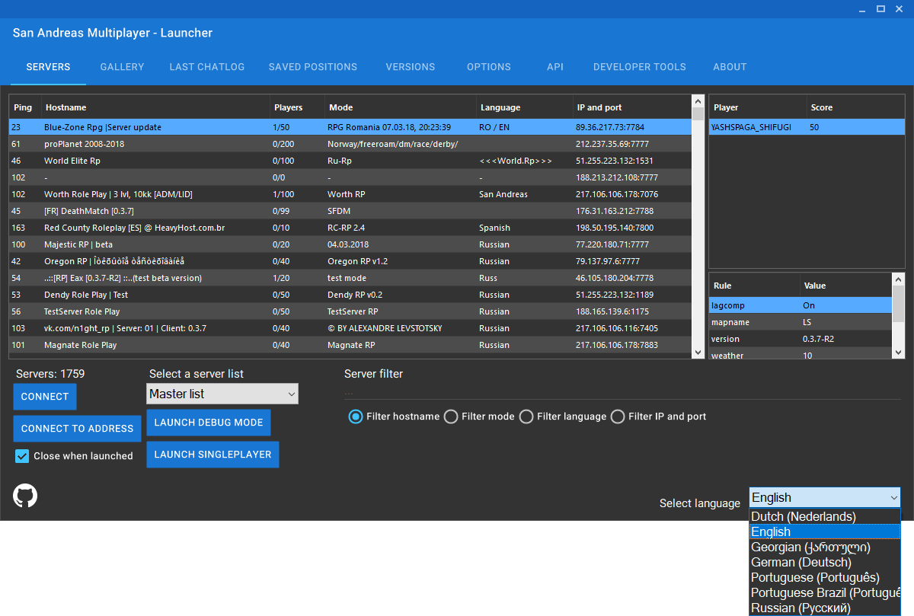

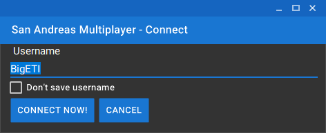

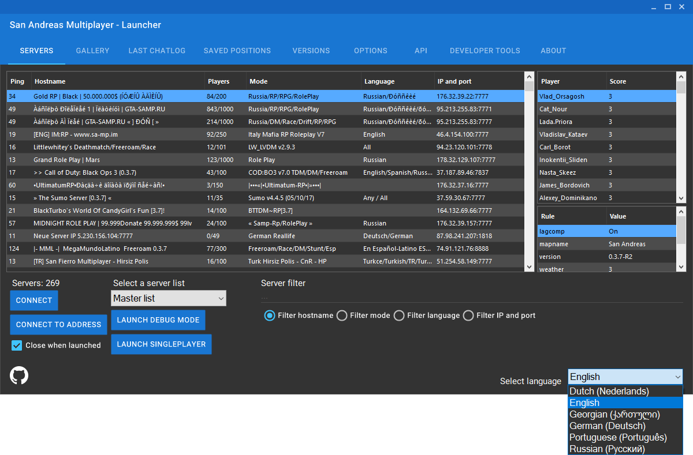

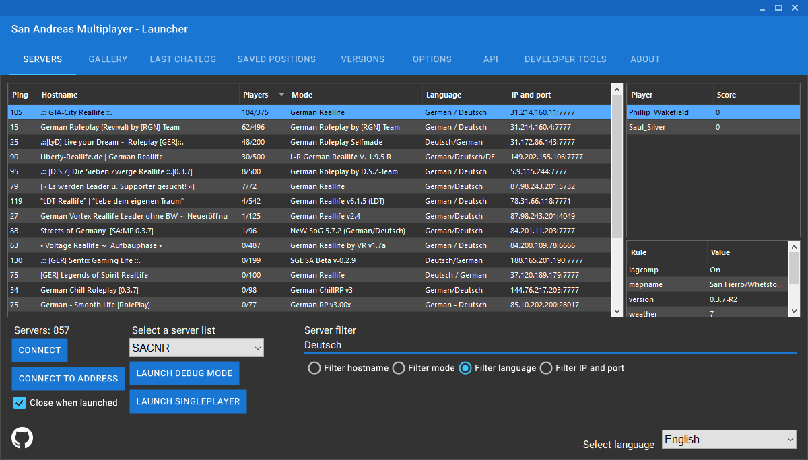

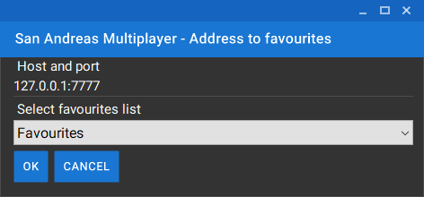

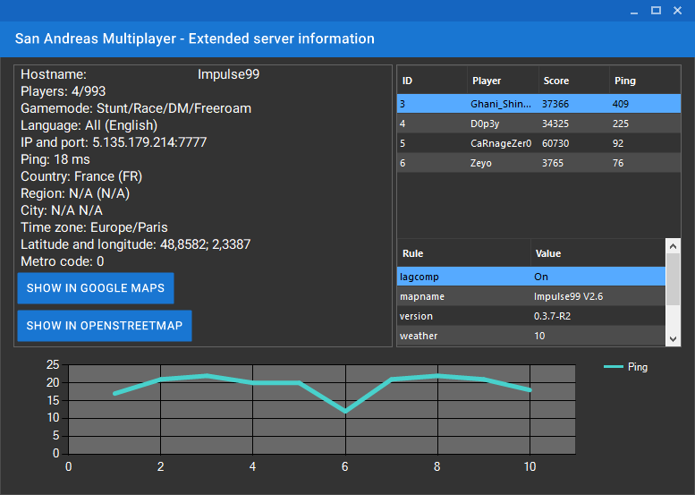

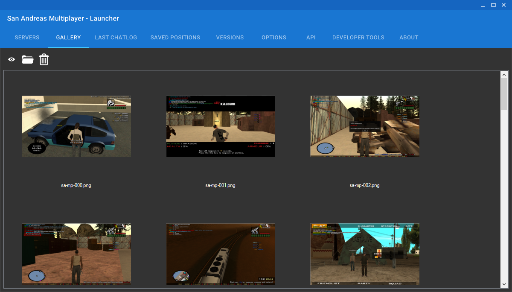

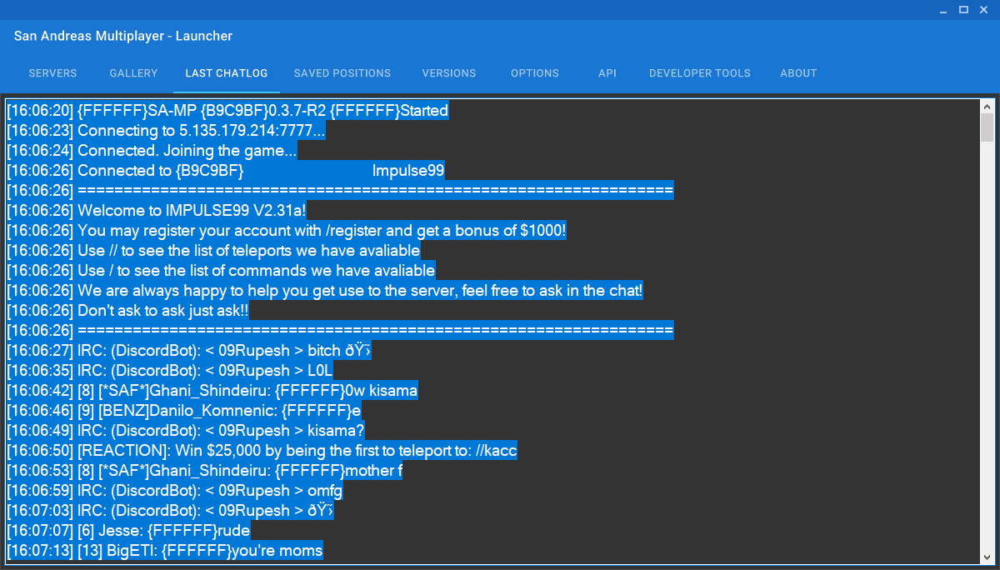

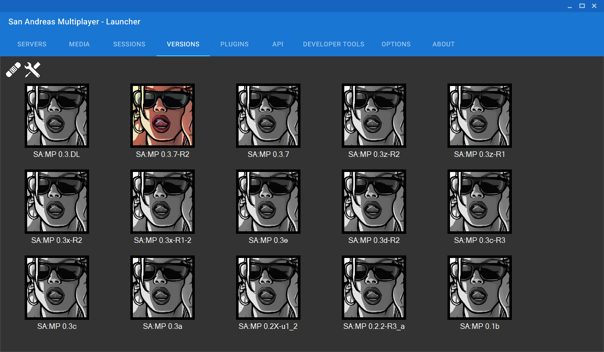

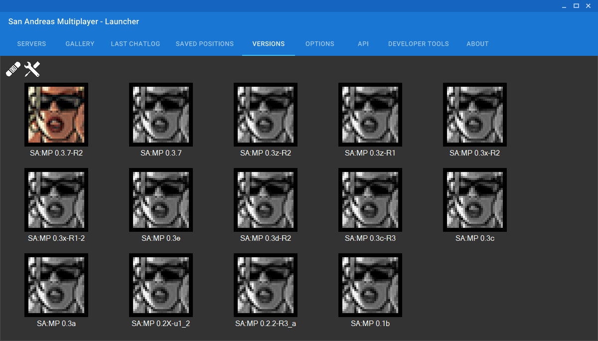

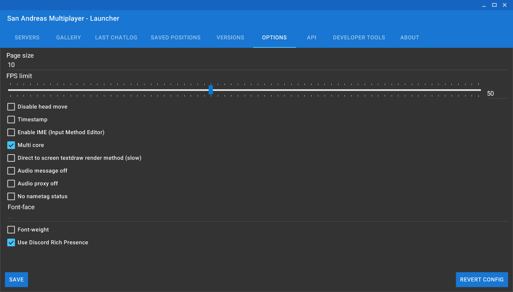

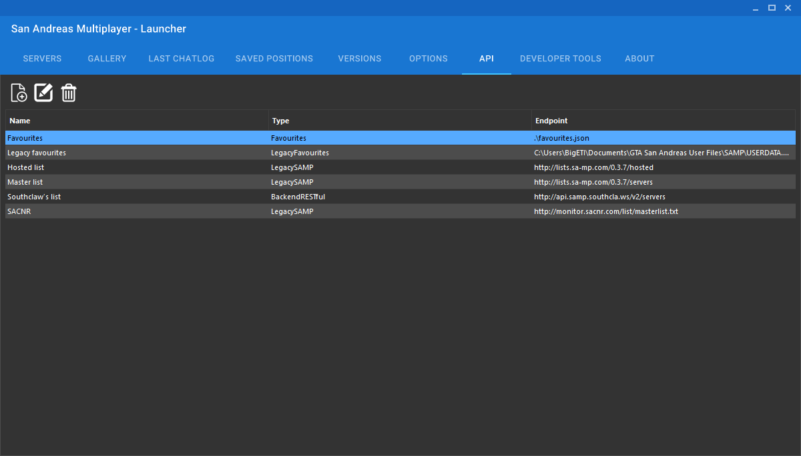

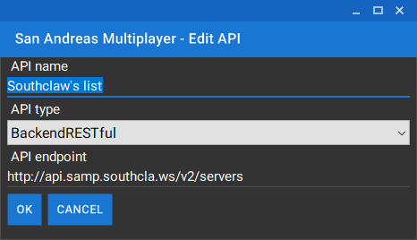

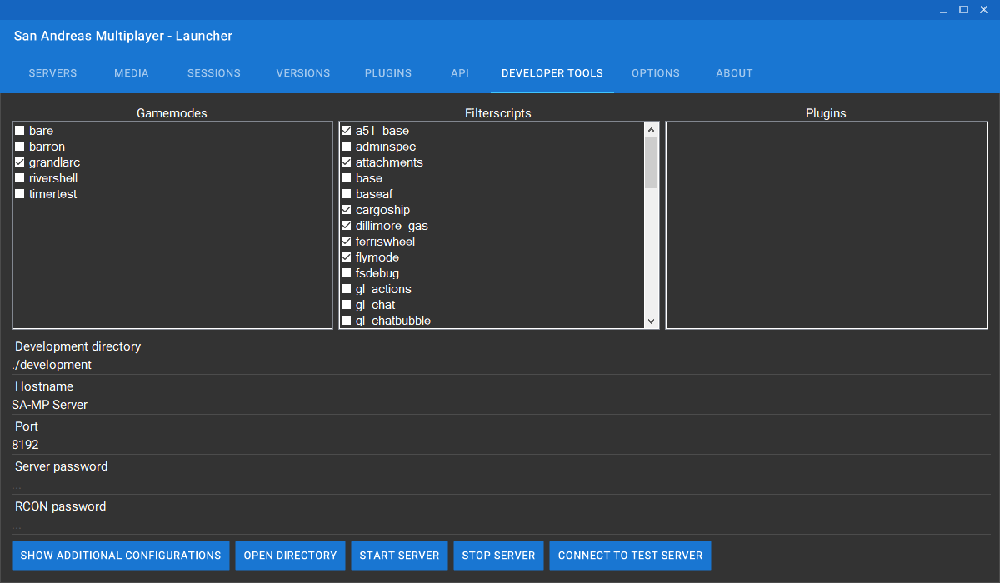

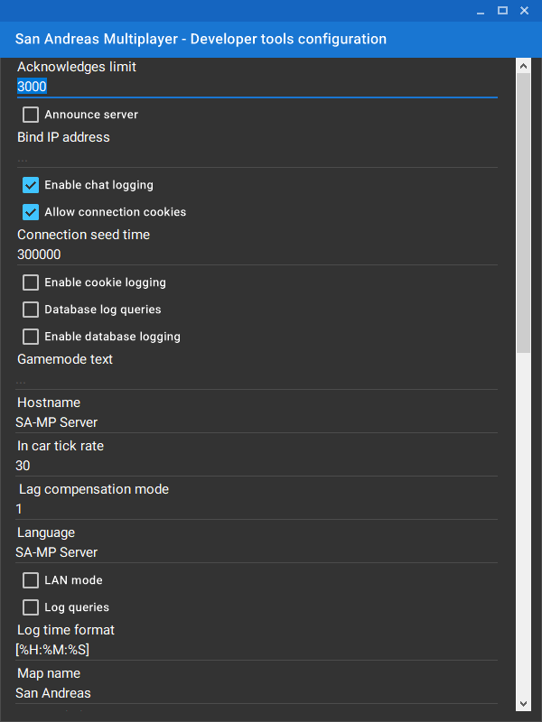

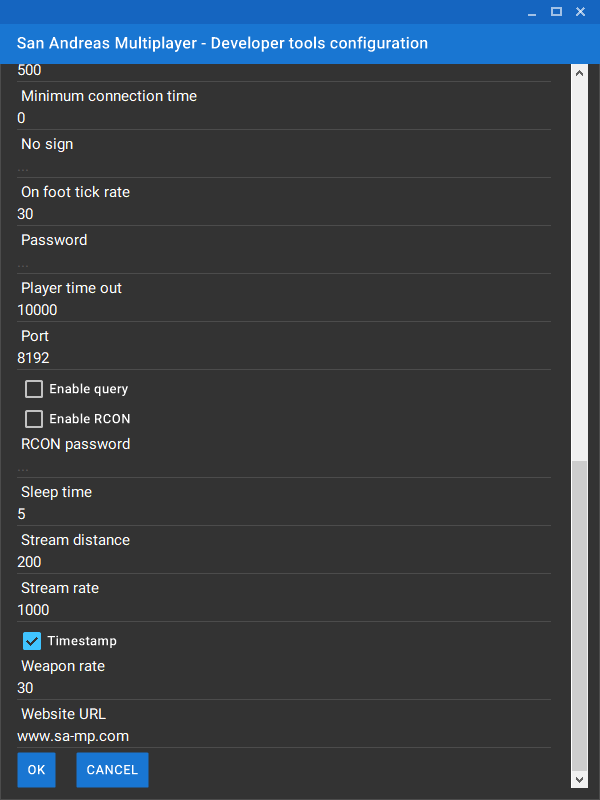

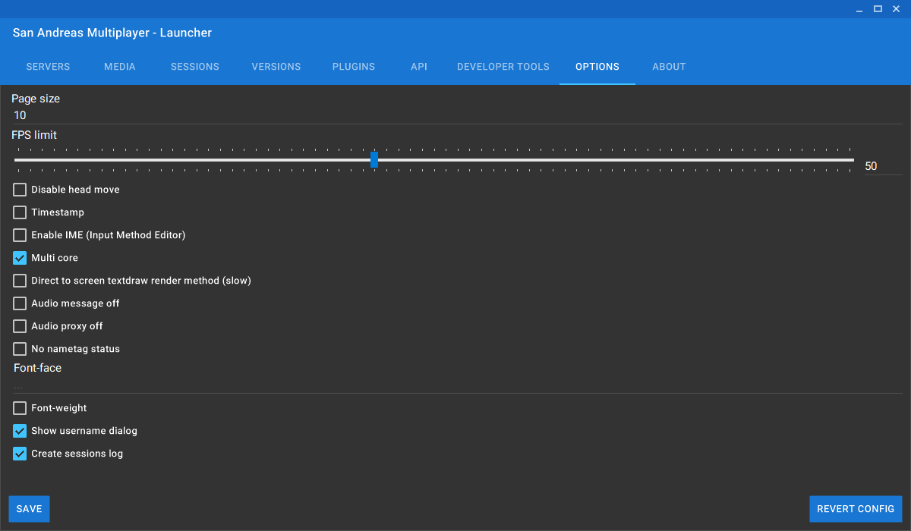

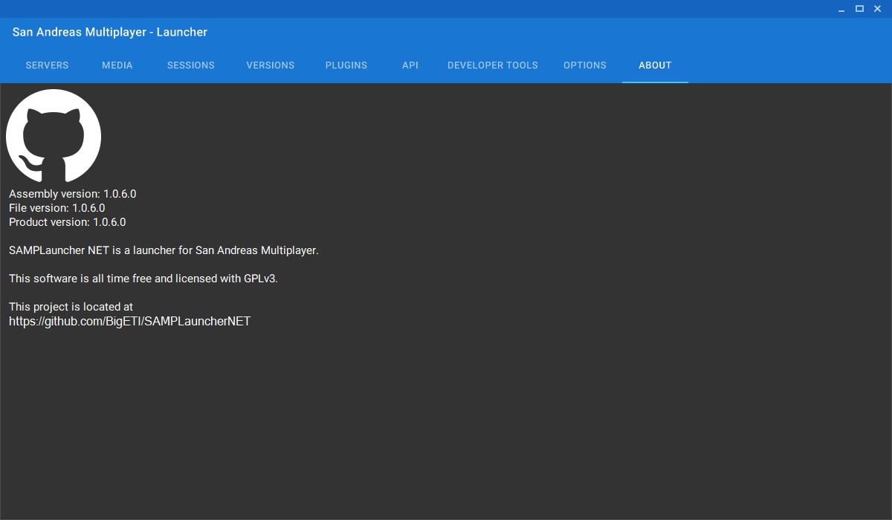
